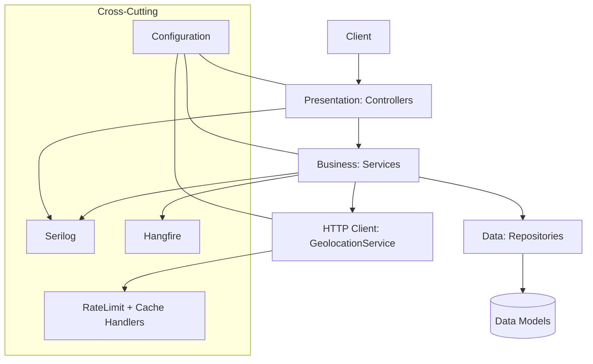

## Blocked Countries – Overview and Guide

This solution provides an API to block traffic by country, look up IP geolocation, record access attempts, and manage country block lists. It uses a layered architecture with structured logging, lightweight rate limiting/caching for outbound geolocation calls, and background jobs for maintenance.

## Solution Structure

- **Presentation (Web API)**: `Blocked Countries`
  - ASP.NET Core Web API exposing endpoints under `/api/*`
  - Swagger UI (development) at `/swagger`
- **Business (Domain/Services)**: `BlockedCountries.Business`
  - Core service logic and models
  - Orchestrates repositories and external calls (geolocation)
- **Data (Persistence/Repositories)**: `BlockedCountries.Data`
  - In‑memory repository implementations and data models
- **Tests**: `BlockedCountries.Tests`
  - xUnit tests for controllers and services

## Architecture Overview

High-level component view (request → response):

```
Client
  |
  v
Presentation (Web API Controllers)
  |
  |  orchestrate
  v
Business Services (domain logic)
  |
  |  query/commands
  v
Repositories (data access, in-memory)
  |
  |  persist/read domain models
  v
Data Models

Cross-cutting: Serilog logging, configuration binding, Hangfire jobs, HTTP client (geolocation) with rate limiter + cache handler.
```

Optional Mermaid (if your viewer supports it):



## Cross‑Cutting Features

- **Serilog** (structured logging)
  - Configured via `appsettings.json`
  - Request logging middleware enabled (`UseSerilogRequestLogging`)
  - Writes to console/file (per configuration)
- **Swagger/OpenAPI**
  - Enabled in Development
  - Document title: "Blocked Countries API v1"
- **HTTP Client Pipeline for Geolocation**
  - `IGeolocationService` implemented by `GeolocationService`
  - Outbound client configured with base URL, timeout, default headers
  - Handlers:
    - `GeolocationRateLimitHandler` (simple throttle)
    - `GeolocationCacheHandler` (in‑memory caching)
- **Basic Rate Limiting (service‑level)**
- **Caching**: Memory cache registered and used by `GeolocationCacheHandler`
- **Hangfire Background Jobs**
  - Hangfire configured with `MemoryStorage`
  - Recurring job: `TemporalBlockCleanupJob` every 5 minutes to purge expired temporal blocks
- **Configuration**
  - Strongly typed via `GeolocationApiConfig` (BaseUrl, RateLimitPerMinute, etc.)

## Repositories Layer (Data/Persistence)

Interfaces live in `BlockedCountries.Data.Repositories`, with simple in-memory implementations suitable for development/testing. Swap these with persistent stores (SQL/NoSQL) in production.

- `ICountryRepository`
  - `Task<CountryInfo?> GetBlockedCountryAsync(string countryCode)`
  - `Task<bool> AddBlockedCountryAsync(CountryInfo country)`
  - `Task<bool> RemoveBlockedCountryAsync(string countryCode)`
  - `Task<IEnumerable<CountryInfo>> GetAllBlockedCountriesAsync()`
  - `Task<bool> AddTemporalBlockAsync(CountryInfo country)`
  - Behavior: stores blocked (permanent) and temporal records. Temporal entries have `IsTemporalBlock = true` and `ExpiresAt` set.

- `IBlockedAttemptRepository`
  - `Task AddAttemptAsync(BlockedAttempt attempt)`
  - `Task<IEnumerable<BlockedAttempt>> GetAttemptsAsync()`
  - Behavior: append-only log of attempts with `IpAddress`, `CountryCode`, `IsBlocked`, `Timestamp`, `UserAgent`.

Data models (in `BlockedCountries.Data.Models`):
- `CountryInfo { CountryCode, CountryName, BlockedAt, IsTemporalBlock, ExpiresAt }`
- `BlockedAttempt { IpAddress, Timestamp, CountryCode, IsBlocked, UserAgent }`

How the business layer uses repositories:
- `CountryManagementService`
  - Validates inputs and ISO2 country codes
  - Upserts via `ICountryRepository` (permanent or temporal)
  - Paginates and filters expired temporal blocks at query time
- `IpBlockingService`
  - Obtains `IpLookupResponse` via `IGeolocationService`
  - Computes `IsBlocked` with `ICountryManagementService.IsCountryBlockedAsync`
  - Writes audit to `IBlockedAttemptRepository`

Repository swap guidance:
- Introduce new implementations (e.g., `SqlCountryRepository`) and register via DI instead of the in-memory ones.
- Ensure `GetAllBlockedCountriesAsync` supports pagination/filters at the DB layer for scale.

## Dependency Injection (selected registrations)

- Repositories: `ICountryRepository`, `IBlockedAttemptRepository`
- Services: `ICountryManagementService`, `IIpBlockingService`, `IBlockedAttemptService`, `IGeolocationService`
- Handlers: `GeolocationRateLimitHandler`, `GeolocationCacheHandler`

## API Endpoints

Base path: `/api`

### Countries
- `POST /api/countries/block`
  - Body: `{ "countryCode": "US" }`
  - 200 OK: `BlockedCountryResponse`
  - 400 BadRequest: validation error
- `DELETE /api/countries/block/{countryCode}`
  - 204 NoContent on success
  - 404 NotFound if country not blocked
- `GET /api/countries/blocked?page=1&pageSize=10&search=term`
  - 200 OK: `PagedResponse<BlockedCountryResponse>`
  - Notes:
    - Filters out expired temporal blocks
    - `search` matches code or name (case‑insensitive)
- `POST /api/countries/temporal-block`
  - Body: `{ "countryCode": "US", "durationMinutes": 30 }`
  - 200 OK: temporal block created
  - 400/409 on invalid or conflicting requests

### IP
- `GET /api/ip/lookup?ipAddress={optional}`
  - If `ipAddress` omitted, server uses `HttpContext.Connection.RemoteIpAddress`
  - 200 OK: `IpLookupResponse`
  - 404 if IP info unavailable; 400 on invalid input
- `GET /api/ip/check-block`
  - Uses client IP; looks up country; checks block list; logs attempt
  - 200 OK: `CheckBlockResponse { ipAddress, countryCode, isBlocked }`

### Logs
- `GET /api/logs/blocked-attempts?page=1&pageSize=10`
  - 200 OK: `PagedResponse<BlockedAttemptResponse>`

## Main Business Services

- `CountryManagementService`
  - Block country permanently
  - Unblock country
  - Add temporal block (expires at a future time)
  - List blocked countries with search/pagination and temporal‑expiry filtering
- `IpBlockingService`
  - Lookup IP geolocation via `IGeolocationService`
  - Check if client IP is blocked; logs attempt with user agent and country
- `GeolocationService`
  - Validates IP format
  - Throttles outbound requests (semaphore + minimal interval)
  - Parses JSON from the remote API
  - Returns simplified `IpLookupResponse` or `null` on error/limit

### Request Lifecycle (Example: GET /api/ip/check-block)

1) Controller resolves client IP (from `RemoteIpAddress`).
2) Calls `IpBlockingService.CheckIpBlockStatusAsync(ip, HttpContext)`.
3) Service calls `IGeolocationService.LookupIpAddressAsync(ip)`.
4) Service asks `ICountryManagementService.IsCountryBlockedAsync(countryCode)`.
5) Service writes `BlockedAttempt` via `IBlockedAttemptRepository`.
6) Returns `CheckBlockResponse` to controller → HTTP 200.

## Logging

- Serilog configured in `Program.cs` and `appsettings*.json`
- Request logs + custom logs from services (warnings/errors)
- Example outputs in `Logs/` directory when file sink enabled

## Jobs (Hangfire)

- Recurring job `temporal-block-cleanup` every 5 minutes (UTC)
- Storage: in‑memory (for demo/dev). For production, switch to a persistent Hangfire storage provider

## Configuration

`appsettings.json` (simplified):
- `GeolocationApi`:
  - `BaseUrl`: base URL of the geolocation service
  - `RateLimitPerMinute`: used by `GeolocationService`
- `Serilog`: sinks/levels/enrichment

## Build & Run

- Requirements: .NET 8 SDK
- Build: `dotnet build`
- Run API: `dotnet run --project "Blocked Countries/Blocked Countries.csproj"`
- Swagger (Dev): `https://localhost:{port}/swagger`

## Tests

- Test project: `BlockedCountries.Tests`
- Run: `dotnet test "BlockedCountries.Tests/BlockedCountries.Tests.csproj"`
- Coverage (optional): add coverlet or your preferred tool

## Notes & Extensibility

- Replace Hangfire memory storage and in‑memory repositories with persistent stores before production
- Replace `GeolocationService` base URL and add API key headers if required by the provider
- Tighten rate‑limit/caching strategies as needed (e.g., Polly, distributed cache)
- Expand model validation/DTOs and add authorization if exposing publicly


